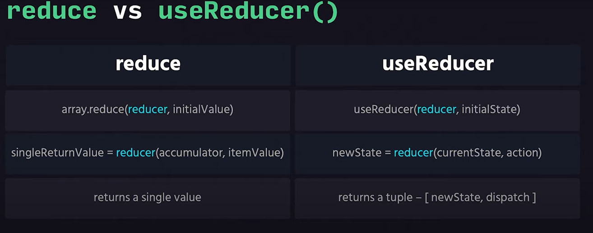

# [React Context API  and UserReducer  with Project](https://react-context-and-usereducer-project.netlify.app/)


> এই প্রজেক্ট  মাধ্যমে  রিএক্ট কনটেক্সট এর   মুটামুটি বেসিক ধারণা লাভ করা যাবে। 

> রিএক্ট কনটেক্সট হুক  ও  UserReducer  এর মাধ্যমে    ডাটা গুলো যে কোনো কম্পোনেন্ট গুলো  প্রপস ড্রিলিং ছাড়াই  এক্সেস করা  যায়. যার ফলে প্রজেক্ট এর   কোড গুলো অনেক কম হয় এবং ডাটা আদান প্রদান করতে অনেক সহজ হয়. উদাহরণ হিসেবে  একটা  ছবি নিচে দেওয়া হলো -   

### UserReducer Hook 
- এটা একটা রিএক্ট হুক  যেটা স্টেট ম্যানেজ করতে  ব্যবহার করা হয়।  
- কিন্তু আমরা জানি useState() হুক স্টেট ম্যানেজমেন্ট  করতে ব্যবহার হয়। 
- রিএক্ট  এ স্টেট চেঞ্জ  করার একটা মাকানিসম 

#### এখানে আমাদের কমন প্রশ্ন যে - 
> কেন আমরা   useReducer  ব্যবহার করবো ?

1. useState  হুক   বানানো হয়েছে  useReducer  এর উপর ব্যাস করে
1. useReducer () হুক userState  হুক এর এজটা বিকল্প 

#### তাহলে  useState   এবং useReducer   হুক এর  মাঝে পার্থক্য কি ? 

আমাদের রিএক্ট হুক  গুলোর মধ্যে আছে 
- useState
- useEffect 
- useMemo
- useRef
- useCallbakck 
- useContext
- useReducer etc. 

অর্থাৎ use    এর পরবর্তী শব্দের মাধ্যমে  আমরা সহজে  বুজতে  পারি যে সেটা  কোন বিষয়ের জন্য ব্যবহার করা হবে।  

#### তাহলে এখন আমাদের সবার কমন ,  প্রশ্ন তা হলো Reduce  কি ? 
> Reduce  রিএক্ট এর কোনো কনসেপ্ট না।  এটি জাভাস্ক্রিপ্ট এর কনসেপ্ট।  আমাদের প্রথমে বুজতে হবে জাভাস্ক্রিপ্ট এর reduce বিষয়টা কি ? 
> reduce শব্দের অর্থ ছোট করে নিয়ে আ।  array এর ভিতরে একাধিক এলিমেন্ট থাকে।  আর array এর একাধিক ভালুকে একটি ভ্যালু তে রূপান্তর   করার   কাজটা Array .Reduce   করে।  
> Reduce ফাঙ্কশন এ দুটি প্যারামিটার থাকে।  একটি accumulator  এবং অন্যটি currentValue . 
> accumulator  হলো আগের স্টেপ এর  রেজাল্ট। 
currentValue  হলো  Array তে  যখন Array .reduce ফাঙ্কশন কাজ করবে তখন যে  Array এলিমেন্ট নিয়ে কাজ করবে সেটা হলো currentValue . 
Reduce ফাঙ্কশন এ accumulator এ ডিফল্ট  মান ০ থাকে।  কিন্তু reduce এ Accumulator এর ম্যান নির্দিষ্ট করে দেওয়া  যায়।   যেটা পরবর্তীতে ডিফল্ট ম্যান হিসেবে কাজ করে 

### reduce  ও  useReducer  এর পার্থক্য 



### useState   ও  useReducer কখন কোনটা ব্যবহার করবেন  


### রিএক্ট এ useReducer ব্যবহার জিরার কনসেপ্ট হলো - 
- শুরুতে আমাদের  কে useReducer হুক ইম্পোর্ট করে নিতে হবে।  
- পরবর্তীতে আমাদের useReducer  এ দুটি  পেরামিটার (reducer, initializeState) হিসেবে ভ্যালু থাকে তা দিতে  হবে।
- কম্পোনেন্ট ফাঙ্কশন এর  উর্পরে অর্থাৎ বয়লার প্লেট  এ  initializeState   এবং reduce  ফাঙ্কশন দিতে হবে।  
- initializeState  এ ডিফল্ট হিসেবে নির্দিষ্ট ম্যান দিতে হবে।  
- reduce এ দুটি পেরামিটার (state , action )   থাকে। 
- অ্যাকশন বা  ইভেন্ট যখন কোনো ইভেন্ট ঘটে তখন আমাদের reduce এর action এ যখন  কোনো ইভেন্ট ঘটে তখন reducer এর স্টেট  পরিবর্তন হয়।  
- Reduce ফাঙ্কশন  এ Switch  ব্যবহার করে Action  দিতে   হয়  
- userReducer একটি Tuple  রিটার্ন করে।  
- Tuple  এ   প্রথমে আমরা State  এর value   পাই এবং দ্বিতীয় তে স্টেট Action  করার জন্য Dispatch  পেয়ে থাকি।  
#### Code  useReducer Hook use  simple  project 


```javascript 
import { useReducer } from 'react';

const initialState = 5;
const reducer = (state, action) => {
    switch (action) {
        case 'increment':
            return state + 1;
        case 'decrement':
            return state - 1;
        default:
            return state;
    }
};

export default function Counter() {
    const [count, dispatch] = useReducer(reducer, initialState);
    return (
        <div>
            <div>Count - {count}</div>
            <button type="button" onClick={() => dispatch('increment')}>
                Increment
            </button>
            <button type="button" onClick={() => dispatch('decrement')}>
                Decrement
            </button>
        </div>
    );
}
```


## Complex State Manage by useReducer 

useReducer  এর  মাধ্যমে আমরা অবজেক্ট স্টেট   ম্যানেজ খুবই সহজে করতে  পারি।    অবজেক্ট স্টেট এবং  অবজেক্ট অ্যাকশন ব্যবহার করার নিয়ম নিম্নে উল্লেখ করা হলো - 

- initialState    অবজেক্ট  আকারে ভ্যালু দিতে হবে 
- Action  অবজেক্ট আকারে দিলে  dispatch  এ  অবজেক্ট হিসেবে  declaire  করতে হবে 
-  একাধিক   initialState  থাকলে তাহলে শুরুতে mutable   করে  নিতে হবে 
- স্টেট এর ভ্যালু গুলো get  করার   সময় স্টেট এর অবজেক্ট হিসেবে  করতে হবে 

> ## Coplex State manage Code 

 ```javascript 
import { useReducer } from 'react';

const initialState = {
    counter: 0,
    counter2: 0,
};
const reducer = (state, action) => {
    switch (action.type) {
        case 'increment':
            return { ...state, counter: state.counter + action.value };
        case 'decrement':
            return { ...state, counter: state.counter - action.value };
        case 'increment2':
            return { ...state, counter2: state.counter2 + action.value };
        case 'decrement2':
            return { ...state, counter2: state.counter2 - action.value };
        default:
            return state;
    }
};

export default function Counter() {
    const [count, dispatch] = useReducer(reducer, initialState);
    return (
        <div>
            <div>
                <div>Count - {count.counter}</div>
                <button
                    type="button"
                    onClick={() =>
                        dispatch({
                            type: 'increment',
                            value: 1,
                        })
                    }
                >
                    Increment by 1
                </button>
                <button
                    type="button"
                    onClick={() =>
                        dispatch({
                            type: 'decrement',
                            value: 1,
                        })
                    }
                >
                    Decrement by 1
                </button>
            </div>
            <div>
                <div>Count2 - {count.counter2}</div>
                <button
                    type="button"
                    onClick={() =>
                        dispatch({
                            type: 'increment2',
                            value: 1,
                        })
                    }
                >
                    Increment2 by 1
                </button>
                <button
                    type="button"
                    onClick={() =>
                        dispatch({
                            type: 'decrement2',
                            value: 1,
                        })
                    }
                >
                    Decrement2 by 1
                </button>
            </div>
        </div>
    );
```


# useContext and useReducer   একসাথে ব্যবহার করার নিয়ম

আমাদের কোনো ভ্যালু যদি গ্লোবাল স্টেট এ  রেখে দেয়  তখন  যেকোনো  কম্পোনেন্ট থেকে এই ডাটা আমরা এক্সেস পেতে [এরই কোনো ধরণের প্রপ্স ড্রিলিং  ছাড়াই।  তাই আমরা  রিএক্ট এর  context  api  ব্যবহার করি।  

contetext  api   এবং useReducer  একসাথে ব্যবহার করতে চাই তাহলে যেভাবে ব্যবহার করতে হবে  তা নিম্নে দেওয়া হলো - 

- শুরুতে   createContext   import  করে নিতে হবে 
- তারপর আমাদের কে context  এর নাম দিয়ে তৈরি করে নিতে হবে
- parent  এলিমেন্ট কে context  দ্বারা wrapper  করে দিতে হবে।  
- context  এ ভ্যালু গুলো সেট করে দিতে হবে  
### App.js 
```javascript
import React, { useReducer } from 'react';
import ComponentA from './components/ComponentB';

export const counterContext = React.createContext();

const initialState = 0;
const reducer = (state, action) => {
    switch (action) {
        case 'increment':
            return state + 1;
        case 'decrement':
            return state - 1;
        default:
            return state;
    }
};

export default function App() {
    const [count, dispatch] = useReducer(reducer, initialState);
    return (
        <div className="app">
            <div>Count: {count}</div>
            <counterContext.Provider value={{ countDispatch: dispatch }}>
                <ComponentA />
            </counterContext.Provider>
        </div>
    );
}

```


### CountView File 

```javascript 
import { useContext } from 'react';
// eslint-disable-next-line import/no-cycle
import { counterContext } from '../App';

export default function ComponentA() {
    const countContext = useContext(counterContext);

    return (
        <div>
            <p>Component A</p>
            <button type="button" onClick={() => countContext.countDispatch('increment')}>
                Increment
            </button>
            <button type="button" onClick={() => countContext.countDispatch('decrement')}>
                Decrement
            </button>
        </div>
    );
}
```


# Get Data use in useEffect Hook State Manage 

# useState 

```javascript
import { useEffect, useState } from 'react';

export default function GetPost() {
    const [loading, setLoading] = useState(true);
    const [error, setError] = useState('');
    const [post, setPost] = useState({});

    useEffect(() => {
        fetch('https://jsonplaceholder.typicode.com/posts/1')
            .then((response) => response.json())
            .then((data) => {
                setLoading(false);
                setPost(data);
                setError('');
            })
            .catch(() => {
                setLoading(false);
                setPost({});
                setError('There was a problem!');
            });
    }, []);

    return (
        <div>
            {loading ? 'Loading....' : post.title}
            {error || null}
        </div>
    );
}

```


# useReducer

```javascript
import { useEffect, useReducer } from 'react';

const initialState = {
    loading: true,
    error: '',
    post: {},
};

const reducer = (state, action) => {
    switch (action.type) {
        case 'SUCCESS':
            return {
                loading: false,
                post: action.result,
                error: '',
            };
        case 'ERROR':
            return {
                loading: false,
                post: {},
                error: 'There was a problem fetching!',
            };
        default:
            return state;
    }
};

export default function GetPost2() {
    const [state, dispatch] = useReducer(reducer, initialState);

    useEffect(() => {
        fetch('https://jsonplaceholder.typicode.com/posts/1')
            .then((response) => response.json())
            .then((data) => {
                dispatch({ type: 'SUCCESS', result: data });
            })
            .catch(() => {
                dispatch({ type: 'ERROR' });
            });
    }, []);

    return (
        <div>
            {state.loading ? 'Loading....' : state.post.title}
            {state.error || null}
        </div>
    );
}
```


